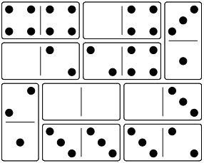
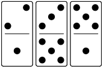

# Experiments in Progress
These are new puzzles that aren't finished yet. You can try them out and let me
know what you think.

* **Bee Donimoes** is a puzzle race game I designed where a swarm of dice bring
  nectar back to the hive. (1-6 players, double-six dominoes, 3-6 dice, and a
  timer)
* **Adding Donimoes** is a puzzle I designed where you add dominoes in the given
    order. (1 player, double-six dominoes)

## Bee Donimoes
A puzzle race game where a swarm of dice bring nectar back to the hive.

### Players
1-6

### Equipment
* a set of dominoes from double blank to double six
* 3 to 6 six-sided dice
* a one-minute timer

### Object
Bring the nectar back to the hive in as few moves as possible, faster than the
other players. One die is chosen as the queen bee and doesn't move, the others
have to form a connected group around her.

### Setup
Decide how many dice you want to use: 3 or 4 are good for learning the game, and
5 or 6 make more challenging puzzles. Put aside all the dominoes with numbers
higher than the number of dice, and shuffle the rest. Then place the shuffled
dominoes face up to form a rectangle of numbers.

Look for the dominoes with a number at one end and a blank at the other. The
number on each of those dominoes is the starting space for the die with the
matching number. You can't have two of those dominoes next to each other, so
swap them with their neighbours until none of them are touching.

Roll 2 dice, and place each one on its starting space. If a die matches the
other die or doesn't match any dominoes, reroll it.

For example, here's one possible setup for four dice:

### Play
The game is played in rounds, and each round starts by adding a die to be the
queen bee. Take one of the dice that's not on the board, and roll it until it
matches one of the empty starting spaces. Place it on the starting space.

The queen bee never moves during a round, and all the other bees have to bring
their nectar back to her in one connected group. (Diagonal connections don't
count.)

The dice can only land on their own numbers. They can move between numbers in
two ways:
1. In a straight line along a row or a column. They can pass over other numbers,
    squares with their own number, or other dice. This counts as one move.
2. Changing direction over other dice. In the middle of a regular move, a die
    may make a 90° turn directly above another die. Later in the same move, it
    may make more turns directly above other dice. No matter how many turns it
    makes, this still counts as one move.

The blank on the other end of the queen bee's domino is wild. Any die can land
there. A die may also leave the wild space on a later move.

See the example solution after the rules.

### Solve
As soon as the queen bee is placed, all players try to solve the puzzle at the
same time. Do not touch the dominoes or dice while you are trying to solve the
puzzle! Once a player has found a solution, they say the number of moves they
need, and start the timer. The other players have until the timer ends to find
a better solution.

A solution with fewer moves is always better. If two players find solutions with
the same number of moves, then the player with fewer points wins the tie. If
they have the same points, then the player who said it first wins the tie.

If there is no solution, then the first player to say it's impossible starts the
timer. They win the round if no other player can find a solution before the
timer ends.

### Demonstrate
Whichever player has claimed the best solution when the timer goes now has to
demonstrate that solution, counting the moves out loud. Players should
demonstrate with no more than a few seconds of hesitation. If they made a
mistake or can't remember the solution, let the player who claimed the next best
solution demonstrate it.

The player who successfully demonstrates a solution scores one point.

### Next Round
Put the dice back on their starting spaces. If there are any empty starting
spaces, start the next round by adding a queen bee on one of them. Otherwise,
shuffle all the dominoes and set up again.

### Example Solution
Let's solve the set up above if the 3 die is the queen bee. The first thing to
do is check whether there are enough places for the bees to land around the
queen bee. The queen is surrounded on three sides by 3s and 4s, so something has
to land on the wild space. Next to that is a 4 and a 2, so you know that the
1 has to end up on the wild space with the 2 next to it.

Now that we know where we're going, it seems best to start by moving the 2 where
it can guide the 1 onto the wild spot:

With the 2 in place, the 1 can get to its target.

Finally, the 2 can get to its target with the help of the 1, in a nice leapfrog
pattern.

### End Game
Play for an agreed number of rounds, the player with the most points wins. In
case of a tie, play an extra round.

To play a series of games, start with 3 dice and play 1 round. Add in another
die and all the dominoes with numbers up to 4, then play 2 rounds. Continue with
5 and 6 dice for a total of 10 rounds.

### Variants
If you find the race too stressful, play cooperatively. Choose a player each
turn to move the dice, and have the other players give suggestions for how to
solve it.

It can also be played solitaire, either with or without a timer.

## Adding Donimoes
The idea was to avoid the slow setup phase at the start of the other puzzles.

### Goal
The goal is to add all the dominoes from the queue onto the board. Each problem
shows the queue of dominoes to add, from left to right.

### Start
Take the two dominoes from the left end of the queue and place them on the board
in the same position relative to each other.

For example, if this is the queue:

Then the start position is like this:

Not like this:

### Moves
There are only two ways a domino can move.

#### Adding
The next domino from the queue can be added to the board if it matches at least
two of the adjacent numbers on neighbouring dominoes. Those two adjacent
numbers can match the two ends of the domino, or both match one end.

In this example, the 13 can be added, because it matches the 1 below and the 3
below.

In this example, the 52 can be added, because it matches the 5 beside and the 5
above. The 52 could also be added in the vertical position.

#### Sliding
Move a domino one space along its long axis so that it ends up with at least
one of its numbers next to an adjacent number that adds up to six, or it
matches at least two of the adjacent numbers on neighbouring dominoes.

In this example, the left domino can move down, because the 1 and the 5 add to
six.

The left domino can move back up, because the 1 matches the 1 above, and the 5
matches the 5 to the right.

#### Stay Connected
All the dominoes on the board must stay in one connected group, you can't split the group
after moving a domino.

### Problems
Here are the starting positions for several Adding Donimoes problems. The
solutions are listed at the end.

#### Problem 1

# Solutions
## Adding Donimoes Solutions
Here are the solutions to the Adding Donimoes problems. For each step, move the
listed domino left, right, up, or down. Adding moves contain the domino
numbers, (H)orizontal or (V)ertical direction, and the position to place it.
The top left corner is 11, one space to the right is 21, and one space below is 12.

1. 36D, 23V21, 33D, 53V32, 25H21, 36D, 23D, 22H13, 33D, 53D, 22R

Donimoes is an original puzzle designed by [Don Kirkby][don].

[don]: https://donkirkby.github.com/
