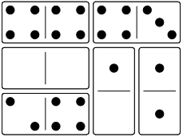
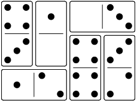
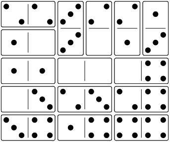

# Experiments in Progress
These are new puzzles that aren't finished yet. You can try them out and let me
know what you think.

* **Bee Donimoes** is a puzzle race game I designed where a swarm of dice bring
  nectar back to the hive. (1-6 players, double-six dominoes, 3-7 dice, and a
  timer)
* **Adding Donimoes** is a puzzle I designed where you add dominoes in the given
    order. (1 player, double-six dominoes)

## Bee Donimoes
A puzzle race game where a swarm of dice bring nectar back to the hive.

### Players
1-6

### Equipment
* a set of dominoes from double blank to double six
* 3-7 six-sided dice
* a one-minute timer

### Object
Bring the nectar back to the hive in as few moves as possible, faster than the
other players. One die is chosen as the queen bee and doesn't move, the others
have to form a connected group around her.

### Setup
Shuffle the dominoes, and place them face up to form an 8x7 rectangle of
numbers. If you have seven dice, put one aside. Then rotate the remaining dice
to form a sequence of numbers starting with 1. Place the 1 die on the
1 in the 1 / blank domino. Place the 2 on the 2 / blank, the 3 on the 3 / blank,
and so on.

### Play
The game is played in rounds, and each round starts by choosing which die is the
queen bee. If you put aside a die, roll it to choose the queen, otherwise roll
one of the dice on the board and then put it back where it was with the number
it had before. If you roll a number that's not on the board, reroll.

The queen bee never moves during a round, and all the other bees have to bring
their nectar back to her in one connected group. (Diagonal connections don't
count.)

The dice can only land on their own numbers. They can move between numbers in
two ways:
1. In a straight line along a row or a column. They can pass over other numbers,
    squares with their own number, or other dice. This counts as one move.
2. Changing direction over other dice. In the middle of a regular move, a die
    may make a 90° turn directly above another die. Later in the same move, it
    may make more turns directly above other dice. No matter how many turns it
    makes, this still counts as one move.

The blank on the other end of the queen bee's domino is wild. Any die can land
there. A die may also leave the wild space on a later move.

### Solve
As soon as the queen bee is chosen, all players try to solve the puzzle at the
same time. Do not touch the dominoes or dice while you are trying to solve the
puzzle! Once a player has found a solution, they say the number of moves they
need, and start the timer. The other players have until the timer ends to find
a better solution.

A solution with fewer moves is always better. If two players find solutions with
the same number of moves, then the player with fewer points wins the tie. If
they have the same points, then the player who said it first wins the tie.

If there is no solution, then the first player to say it's impossible starts the
timer. They win the round if no other player can find a solution before the
timer ends.

### Demonstrate
Whichever player has claimed the best solution when the timer goes now has to
demonstrate that solution, counting the moves out loud. Players should
demonstrate with no more than a few seconds of hesitation. If they made a
mistake or can't remember the solution, let the player who claimed the next best
solution demonstrate it.

The player who successfully demonstrates a solution scores one point. A winning
score is 9 minus the number of players.

### Next Round
Remove the queen bee from the board. If that leaves fewer than 3 dice, shuffle
all the dominoes and set up again. Otherwise, place all the other dice on the
board back in their starting places. Roll to choose the next queen bee.

## Adding Donimoes
The idea was to avoid the slow setup phase at the start of the other puzzles.

### Goal
The goal is to add all the dominoes from the queue onto the board. Each problem
shows the queue of dominoes to add, from left to right.

### Start
Take the two dominoes from the left end of the queue and place them on the board
in the same position relative to each other.

For example, if this is the queue:

Then the start position is like this:

Not like this:

### Moves
There are only two ways a domino can move.

#### Adding
The next domino from the queue can be added to the board if it matches at least
two of the adjacent numbers on neighbouring dominoes. Those two adjacent
numbers can match the two ends of the domino, or both match one end.

In this example, the 13 can be added, because it matches the 1 below and the 3
below.

In this example, the 52 can be added, because it matches the 5 beside and the 5
above. The 52 could also be added in the vertical position.

#### Sliding
Move a domino one space along its long axis so that it ends up with at least
one of its numbers next to an adjacent number that adds up to six, or it
matches at least two of the adjacent numbers on neighbouring dominoes.

In this example, the left domino can move down, because the 1 and the 5 add to
six.

The left domino can move back up, because the 1 matches the 1 above, and the 5
matches the 5 to the right.

#### Stay Connected
All the dominoes on the board must stay in one connected group, you can't split the group
after moving a domino.

### Problems
Here are the starting positions for several Adding Donimoes problems. The
solutions are listed at the end.

#### Problem 1

# Solutions
## Adding Donimoes Solutions
Here are the solutions to the Adding Donimoes problems. For each step, move the
listed domino left, right, up, or down. Adding moves contain the domino
numbers, (H)orizontal or (V)ertical direction, and the position to place it.
The top left corner is 11, one space to the right is 21, and one space below is 12.

1. 36D, 23V21, 33D, 53V32, 25H21, 36D, 23D, 22H13, 33D, 53D, 22R

Donimoes is an original puzzle designed by [Don Kirkby][don].

[don]: https://donkirkby.github.com/
