## Introduction
These are new puzzles that aren't finished yet. You can try them out and let me
know what you think.

## Table of Contents

* [Donimo Drivers](#donimo-drivers) is a puzzle I designed where dice
    can walk over the dominoes or drive them around. (1 player, 4 dice,
    and double-six dominoes)
* [Adding Donimoes](#adding-donimoes) is a puzzle I designed where you
    add dominoes in the given order. (1 player, double-six dominoes)
* [Tetromino Road](#tetromino-road) is a board game I designed where
    you lay out dominoes with roads between them. (2 players, double-six
    dominoes, beads and coins)
* [Writing Rules](#writing-rules) is a section to help me remember how
    to create the different types of diagrams.
* [Solutions](#solutions)

# Puzzles
## Donimo Drivers
Dice can walk or drive to their destination.

### Goal
Get all the blank squares into one connected group. Diagonal connections don't
count.

### Start
Arrange the dominoes in the problem's starting position. Then place a die on
each of the corners, so its top face matches the number it's on.

### Moves
Each die can do one of three things on each turn:

* Walk on a number smaller than its own.
* Drive a domino while sitting on a matching number.
* Rest on a matching number while another die moves.

There are several limits to the moves. Only one die can move at a time, so the
other three must be resting on their own numbers. Once a die starts walking,
it must continue until it rests on its own number again. A die can only walk
onto an empty, neighbouring number, and diagonal neighbours don't count. A
domino can only be driven when it has a die on it, and driven along its longer
direction, not sideways. It moves one space at a time, and all the dominoes
must be in one connected group before and after each move. Again, diagonal
connections don't count.

### Problems
Here are the starting positions for several Donimo Drivers problems. The
solutions are listed at the end.

#### Problem 1

#### Problem 1b

#### Problem 1c

#### Problem 1d

#### Problem 1e

#### Problem 2

#### Problem 3

#### Problem 4
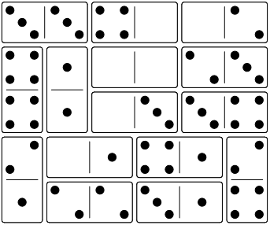

## Adding Donimoes
The idea was to avoid the slow setup phase at the start of the other puzzles.

### Goal
The goal is to add all the dominoes from the queue onto the board. Each problem
shows the queue of dominoes to add, from left to right.

### Start
Take the two dominoes from the left end of the queue and place them on the board
in the same position relative to each other.

For example, if this is the queue:

Then the start position is like this:

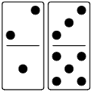

Not like this:

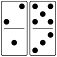

### Moves
There are only two ways a domino can move.

#### Adding
The next domino from the queue can be added to the board if it matches at least
two of the adjacent numbers on neighbouring dominoes. Those two adjacent
numbers can match the two ends of the domino, or both match one end.

In this example, the 13 can be added, because it matches the 1 below and the 3
below.

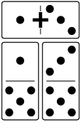

In this example, the 52 can be added, because it matches the 5 beside and the 5
above. The 52 could also be added in the vertical position.

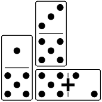

#### Sliding
Move a domino one space along its long axis so that it ends up with at least
one of its numbers next to an adjacent number that adds up to six, or it
matches at least two of the adjacent numbers on neighbouring dominoes.

In this example, the left domino can move down, because the 1 and the 5 add to
six.

The left domino can move back up, because the 1 matches the 1 above, and the 5
matches the 5 to the right.

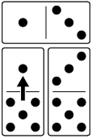

#### Stay Connected
All the dominoes on the board must stay in one connected group, you can't split the group
after moving a domino.

### Problems
Here are the starting positions for several Adding Donimoes problems. The
solutions are listed at the end.

#### Problem 1

# Games
## Tetromino Road
The dominoes are played on an 8x8 grid. Make the edges out of face-down
dominoes, or play on a chess board where a pair of squares are the same size as
one of your dominoes.

Choose which player will play the tetrominoes dark side up, and give them 3
dark player tokens. Give the other player 3 light player tokens. Each player
draws 3 dominoes and keeps them hidden from their opponent.

On your turn, you must place a domino and then mark any spaces that must be
roads. At any time during your turn, you may play a token or tetrominoes.

### Placing Dominoes and Tokens
Dominoes and tokens must be played on empty spaces so that they touch the edge
of the board or another item that's already on the board. Diagonal connections
don't count as touching.

### Placing Roads
If a number on a domino is completely surrounded by other numbers, the
surrounding numbers must exactly equal 3 times the number of neighbours.
Corners must have neighbours equal to 6, sides must equal 9, and centre spaces
must equal 12. If a square has only one empty space next to it and it would be
impossible to fill that space with a legal number, then that space must be a
road. After placing a domino, check to see if any spaces must be roads and place
road markers on them.

At the end of the game, all road spaces on the board must form one connected
road network, so you can also place road markers where they are needed to keep
the roads connected.

If an empty space has no empty spaces next to it, then no dominoes will fit on
it. Place a road marker on it.

If a player token is on a space that must be a road, replace it with a road
marker and give it back to the player. However, check to see whether the player
can use it to play a tetromino before replacing it. The active player can
choose what order to play road markers. 

### Placing Tetrominoes
Tetrominoes need to be played on spaces with either road markers or player
tokens. They cannot be played on spaces with dominoes, other tetrominoes, or
empty spaces. At least one of the spaces must have a player token that belongs
to the player who's playing the tetromino.

If a player's token is getting replaced during their opponent's turn, they may
use it immediately to place a tetromino. The opponent then continues their turn
if they have more road markers to place. (Should the player's turn end when
they have to replace another player's token?)

Tetrominoes can't be moved after they are played, and they must be played with
the player's side up. If a player's token is getting replaced and there aren't
any tetrominoes that will fit, the token is just returned to the player.

### Winning
The player who plays 4 tetrominoes wins.

# Software Tips
## Writing Rules
Here are some examples of the diagrams that you can draw using code blocks:

Basic dominoes are shown as numbers joined by the | or - characters. Leave
spaces between the numbers that aren't joined.

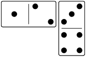

You can mix unjoined cells from Dominosa in with regular dominoes.

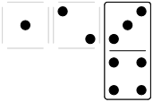

Usually, the dominoes are all lined up with each other, but you can offset them
by half a space.

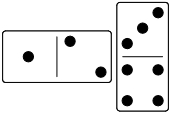

You can draw arrows to mark a moved domino with <^v> characters in the middle of
it, mark an added domino with a +, or a removed domino with a *.

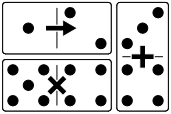

There are several things you can draw on top of the dominoes by adding an extra
section. You can add letter markers on top of the dominoes, and list the number
under each marker.

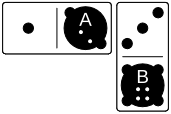

If your markers aren't unique, list them with their positions.

There are two special markers: lower-case b and w for black and white markers.

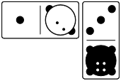

You can add dice by giving the coordinates and the value on top.

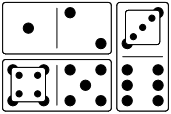

You can add arrows by giving the start coordinates and the directions to move.

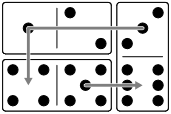

You can combine the different types of extras into the same diagram. Order of
the sections doesn't matter, but order of the arrows matters if they overlap.

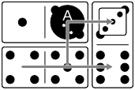

### Dominosa
Dominosa boards can include a partial solution, but one of the headings must be
"Dominosa".

# Solutions
## Donimo Drivers Solutions
The walking moves are described with the number of a die, a direction, and a
distance. For example, 1R3 means move the 1 die to the right, 3 spaces. A move
with no distance means one space. The driving moves have a small letter 'd' for
'domino' after the die number, like 1dR.

1. 3dR, 4dL, 1L, 1U, 1dU
2. 3D, 3R4, 3dU, 4dU, 2L2, 2U3, 2dR
3. 1L2, 2dD, 3L2, 3U, 3L, 3U, 4dD, 1dL2, 3dU, 4R2, 4dU
4. 4dD, 4U, 4L2, 4U, 4dR, 4U3, 4L2, 2dR, 4dR, 3dR, 4D, 4L3, 4dU, 1dU, 1R2, 2L2,
   2D, 2L3, 2D, 2L, 2dD, 2R, 2U2, 2R3, 2U, 2R2, 4dD, 4R3, 4U, 3dL, 4dL, 2dL, 1dR

## Adding Donimoes Solutions
Here are the solutions to the Adding Donimoes problems. For each step, move the
listed domino left, right, up, or down. Adding moves contain the domino
numbers, (H)orizontal or (V)ertical direction, and the position to place it.
The top left corner is 11, one space to the right is 21, and one space below is 12.

1. 36D, 23V21, 33D, 53V32, 25H21, 36D, 23D, 22H13, 33D, 53D, 22R

Donimoes is an original puzzle designed by [Don Kirkby][don].

[don]: https://donkirkby.github.com/
